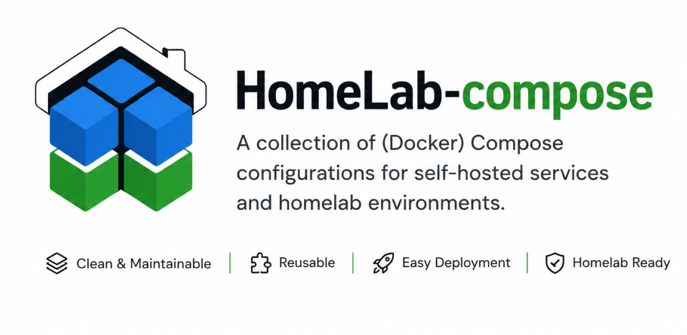

# HomeLab Compose

A collection of Docker Compose configurations for self-hosted services and homelab environments.



## Overview

This repository contains Docker Compose stacks for deploying and maintaining various self-hosted applications. Each service is organized in its own directory and can be deployed independently.

The goals of this repository are to provide:

- Clean and maintainable Docker Compose configurations
- Reusable service definitions
- Simple deployment and updates
- A centralized collection of homelab infrastructure
- Consistent documentation and configuration standards

---

## Repository Structure

```text
.
├── scripts/
│   ├── create-macvlan.sh
│   ├── remove-macvlan.sh
│   └── ...
├── service-a/
│   ├── compose.yml
│   ├── .env.example
│   └── README.md
├── service-b/
│   ├── compose.yml
│   └── README.md
└── README.md
```

Each service directory should contain:

- `compose.yaml` – Docker Compose configuration
- `.env.example` – Example environment variables (optional)
- `README.md` – Service-specific documentation

The `scripts/` directory contains helper scripts for managing the shared infrastructure.

For a full description of every script (usage, options, dependencies), see **[docs/scripts.md](docs/scripts.md)**.

---

## Networking

All Compose projects share a single external Docker **macvlan** network.

### Network Configuration

| Property | Value |
|----------|-------|
| Network Name | `homelab_macvlan` |
| Driver | `macvlan` |
| Subnet | 192.168.178.224/27 |
| Gateway | 192.168.178.1 |

The network is created **once** and then shared by all Compose projects and can be configured via `.env.common`.

Example:

```yaml
networks:
  homelab_macvlan:
    external: true
    name: ${NETWORK_NAME}
```

### Static IP Addresses

Services connected to the macvlan network should use fixed IP addresses (`192.168.178.225 - 192.168.178.254`).

Example:

```yaml
services:
  example:
    networks:
      homelab_macvlan:
        ipv4_address: 192.168.178.235
```

Using static IP addresses ensures that services remain permanently reachable and avoids IP conflicts across different Compose projects.

---

## Included Compose Configurations

| Service | Description | Documentation |
|---------|-------------|---------------|
| `traefik` | Standalone reverse proxy stack for central ingress routing in the homelab. | [traefik/README.md](traefik/README.md) |
| `dashboard` | Automatic home dashboard based on Traefik-published services. | [dashboard/README.md](dashboard/README.md) |
| `poly-php` | Portable Docker-based development environment for testing multiple PHP versions simultaneously. | [poly-php/README.md](poly-php/README.md) |
| `adguard` | Docker Compose project for running AdGuard Home in a homelab environment. | [adguard/README.md](adguard/README.md) |
| `gitea` | Docker Compose project for running Gitea (self-hosted Git service) in a homelab environment. | [gitea/README.md](gitea/README.md) |
| `forgejo` | Docker Compose project for running Forgejo (self-hosted Git service) in a homelab environment. | [forgejo/README.md](forgejo/README.md) |
| `forgejo` | Docker Compose project for running Forgejo (self-hosted Git service) in a homelab environment. | [forgejo/README.md](forgejo/README.md) |

---

## Getting Started

### 1. Clone the repository

```bash
git clone https://github.com/clavicarius/homelab-compose.git
cd homelab-compose
```

### 2. Create shared environment configuration

Create `.env.common` from the shared example file and adjust it for your network:

```bash
cp .env.common.example .env.common
```

### 3. Create the shared macvlan network

Configure the network settings in `.env.common` and run:

```bash
./scripts/create-macvlan.sh
```

For agent commits, copy `.git-author.example` to `.git-author` and set your name and email (see [docs/git-author.md](docs/git-author.md)).

This only needs to be done once.

### 4. Navigate to the desired service

```bash
cd <service>
```

### 5. Copy the example environment file

If the service provides one:

```bash
cp .env.example .env
```

### 6. Start the service

```bash
../scripts/docker-up.sh
```

---

## Conventions

- One service per directory
- One `README.md` per service
- Store secrets outside version control
- Prefer named volumes for persistent data
- Pin image versions whenever possible
- Use the shared external `homelab_macvlan` network
- Assign static IP addresses to services connected to the macvlan network

---

## License

This repository is licensed under the MIT License.
